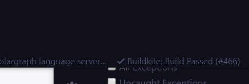
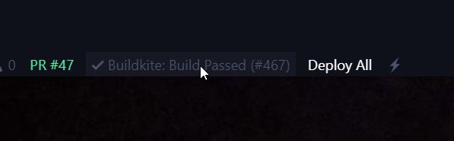

# Buildkite Status

The extension allows you to view the build status of your project on [Buildkite CI](https://buildkite.com) from within Visual Studio Code.

## Features

At this moment the extension allows you to preview the build status of the specific project branch that you want to observe (as specified in the configuration file described below). In this first version the extension allows only for a single project monitor. 



## Usage

Once installed, the build status of your specific project branch will be displayed at the Visual Studio Code status bar. In order to be enable the extension to communicate with the Buildkite CI/CD, you need to have ```.buildkite-ci-status.yml``` file in the root of your Visual Studio Code workspace. In this file you specify the following:

```yml
token: buildkite-auth-token
project: project-slug
organization: organization
```

**Note:** Do not forget to add this file to .gitignore list.

### Commands

The extension contributes the following commands to your Visual Studio Code:

* **Buildkite: Update Status**: Manually refresh the build status of the specified branch.
* **Buildkite: View Branch in Buildkite**: Open the specified branch in the Buildkite CI web page.
* **Buildkite: Show latest build result**: Show latest build result in Visual Studio Code tab-window without leaving your IDE.

### Status Bar

You can also click on build status bar to visit Buildkite and see the results.



### Settings

The extension contributes the following settings parameters to your Visual Studio Code:

* **buildkiteci.pollInterval**: Interval (in minutes) for refreshing the build status.

E.g. every five minutes:

```sh
"buildkiteci.pollInterval": 5
```

The default value is 20 seconds.

## Contribution

In case you run into any issues while using the extension or have a suggestion on how to improve it, please [create an issue here](https://github.com/gencer/buildkite-ci-status/issues).

[based on work by ksokolovic](https://github.com/ksokolovic/semaphore-ci-status/issues).

## Attention

**This is an unofficial extension** aimed at automating build statuses to show in Visual Studio Code. This extension or its maintainer is not in any way affiliated with Buildkite.

## Roadmap

- [x] Ability to fetch build log inside VSCode output or debug console (or maybe in a popup window)
- [ ] Ability to cancel or retry build inside VSCode.
- [ ] Ability to watch specific branches

## License

Distributed under the [MIT License](LICENSE).
